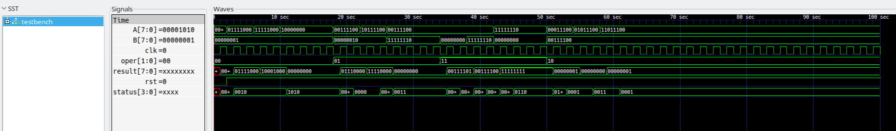
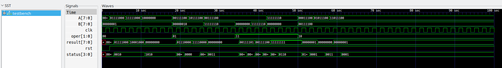

# Projekt indywidualny SCK - Dokumentacja

## Skrypty

Pierwszy skrypt `$ mod_sym.sh <nazwa modułu>` uruchamia symulację testbenchu wybranego modułu, natomiast
`$ mod_synth_sym.sh <nazwa modułu>` symulację poprzedza syntezą odpowiednihc modułów. Wynik syntezy jest zapisywany w katalogu `/src/synth/`

**UWAGA! Oba skrypty powinny być uruchamiane z poziomu** `sck-i/src/`   
```
Dostępne moduły:
- left_shift
- compare
- bit_change
- u2_to_sm
- mux_4to1
- register
- exe_unit_w26
```

Aby uruchomić testbench ręcznie, wystarczy uruchomić adekwatny skrypt, a następnie otworzyć plik `.vcd` znajdujący się w katalogu `/src/testbench/sim/`   

Nie jest to najlepsze rozwiązanie, ale zajeło mi to dużo mniej czasu w porównaniu do próby wykonania tego w `make`

## Moduły   

### Left Shift
Przesuwa liczbę o daną liczbę bitów

Parametry:   
`N` - określa liczbę bitów   

Wejścia:   
`A` - liczba w systemie U2   
`B` - liczba w systemie U2 (>0) 

Wyjścia:   
`result` - N-bitowy wynik operacji A<<B (z zachowaniem znaku)   
`error` - flaga błędu


### Compare
Porównuje liczbę A z liczbą B (A<B)

Parametry:   
`N` - określa liczbę bitów   

Wejścia:   
`A` - liczba w systemie U2   
`B` - liczba w systemie U2

Wyjście:   
`result` - `N` bitowy wynik operacji A<B

### Bit change
Zmienia dowolny bit (o indeksie B) z liczby A na 1

Parametry:   
`N` - określa liczbę bitów   

Wejścia:   
`A` - liczba w systemie U2   
`B` - liczba w systemie U2 (>0) 

Wyjścia:   
`result` - zmodyfikowana liczba A       
`error` - flaga błędu

### U2 to SM
Konwertuje liczbę z systemu U2 na system SM (znak moduł - ang. sign-magnitude)

Parametry:   
`N` - określa liczbę bitów   

Wejście:   
`u2_number` - liczba w systemie U2   

Wyjścia:   
`sm_number` - liczba w systemie SM    
`error` - flaga błędu

### Mux
Multiplekser PIPO (Parallel-Input-Parallel-Output)

Parametry:   
`N` - określa liczbę bitów

Wejścia:   
`sel` - dwubitowy sygnał selekcji    
`in0 - in3` - kolejne N bitowe wejścia   

Wyjścia:   
`out` - wybrany sygnał

### Regsiter
Rejest o aktywnym zboczu narastającym i resecie synchronicznym

Parametry:   
`N` - określa liczbę bitów

Wejścia:   
`clk` - zegar   
`reset` - reset   
`in` - N-bitowy sygnał wejściowy   

Wyjścia:   
`out` - sygnał wyjściowy

## exe_unit_w26
Jednostka realizująca operacje arytmetyczne logiczne i inne na liczbach całkowitych w kodzie U2. Wykorzystuje ona wszystkie powyżej opisane moduły.

Parametry:   
`N` - określa liczbę bitów sygnału sterującego   
`M` - określa liczbę bitów danych na których są wykonywane operacje

Wejścia:   
`i_oper` - N-bitowe wejście sterujące (kombinacyjne) określające rodzaj operacji do wykonania na argumentach A i B   
`i_argA` - M-bitowe wejście argumentu A   
`i_argB` - M-bitowe wejście argumentu B   
`i_clk` - wejście zegara (aktywne zbocze narastające)   
`i_rsn` - wejście resetu synchronicznego (wartość logiczna 0 ustawia wszystkie   
rejestry modułu exe_unit_w26 na wartość 0)

Wybór opcji za pomocą wejścia i_oper:
```
00 - Konwersja A (U2) na system Znak-Moduł
01 - Przesunięcie A o B
11 - Zmiana bitu o indeksie B w A
10 - Porównanie A < B
```

Wyjścia:   
`o_result` - wyjście synchroniczne (z rejestru) wyniku operacji, zmiana wyjścia następuje na zboczu narastającym zegara i_clk

Jednostka **exe_unit_w26** ma dodatkowe synchroniczne (z rejestru) wyjście
statusu `o_status` (zmiana wyjścia następuje na zboczu narastającym zegara `i_clk`), którego kolejno bity określają znaczniki:   

`ERROR` - operacja nie została wykonana; wartość o_result jest nieokreślona   
`EVEN` - w wyniku jest parzysta liczba jedynek    
`ONES` - wszystkie bity wyniku są ustawione na 1    
`OVERFLOW` - w wyniku operacji nastąpiło przepełnienie (brak możliwości
zapisania wyniku w zadanej liczbie bitów)

## Schemat jednostki


## Wynik symulacji


## Wynik symulacji po syntezie


Wyniki po syntezie odpowiadają tym uzyskanym w symulacji każdego modułu (z osobna jak i całej jednostki exe_unit_w26). 

## Statystyki

Pełny raport z przeprowadzonej sytezy modułu `exe_unit_w26` został zapisany w pliku [src/log.txt](./src/log.txt)

| |paramod| | | | | | |modules| | | | | | |suma (moduły)| | |
|:---:|:---:|:---:|:---:|:---:|:---:|:---:|:---:|:---:|:---:|:---:|:---:|:---:|:---:|:---:|:---:|:---:|:---:|
| |bit_change N=8|compare N=8|left_shift N=8|mux_4to1 N=8|regiter N=4|register N=8|u2_to_sm N=8|bit_change|compare|left_shift|mux_4to1|register|u2_to_sm|exe_unit_w26| | | |
|NOT|10|0|1|0|0|0|1|10|0|1|0|0|1|22|34| |NOT|
|AND|0|0|1|1|4|8|1|0|0|1|1|8|1|16|27| |AND|
|OR|26|1|18|0|0|0|9|26|1|18|0|0|9|83|137| |OR|
|XOR|0|4|0|0|0|0|6|0|4|0|0|0|6|20|30| |XOR|
|ORNOT|2|2|7|9|0|0|0|2|2|7|9|0|0|24|44| |ORNOT|
|ANDNOT|0|7|9|9|0|0|3|0|7|9|9|0|3|37|65| |ANDNOT|
|XNOR|0|5|0|0|0|0|0|0|5|0|0|0|0|11|16| |XNOR|
|NAND|0|1|0|0|0|0|0|0|1|0|0|0|0|5|6| |NAND|
|MUX|0|0|14|8|0|0|6|0|0|14|8|0|6|28|56| |MUX|
|NOR|0|1|2|1|0|0|0|0|1|2|1|0|0|5|9| |NOR|
|wires|43|30|47|34|5|5|20|43|30|47|34|5|20|257|436| |wires|

```
=== $paramod\bit_change\N=8 ===

   Number of wires:                 43
   Number of wire bits:             64
   Number of public wires:           4
   Number of public wire bits:      25
   Number of memories:               0
   Number of memory bits:            0
   Number of processes:              0
   Number of cells:                 48
     $_AOI3_                         1
     $_NOT_                         10
     $_OAI3_                         9
     $_ORNOT_                        2
     $_OR_                          26

=== $paramod\compare\N=8 ===

   Number of wires:                 30
   Number of wire bits:             51
   Number of public wires:           3
   Number of public wire bits:      24
   Number of memories:               0
   Number of memory bits:            0
   Number of processes:              0
   Number of cells:                 28
     $_ANDNOT_                       7
     $_AOI3_                         5
     $_NAND_                         1
     $_NOR_                          1
     $_OAI3_                         2
     $_ORNOT_                        2
     $_OR_                           1
     $_XNOR_                         5
     $_XOR_                          4

=== $paramod\left_shift\N=8 ===

   Number of wires:                 47
   Number of wire bits:             68
   Number of public wires:           4
   Number of public wire bits:      25
   Number of memories:               0
   Number of memory bits:            0
   Number of processes:              0
   Number of cells:                 52
     $_ANDNOT_                       9
     $_AND_                          1
     $_MUX_                         14
     $_NOR_                          2
     $_NOT_                          1
     $_ORNOT_                        7
     $_OR_                          18

=== $paramod\mux_4to1\N=8 ===

   Number of wires:                 34
   Number of wire bits:             70
   Number of public wires:           6
   Number of public wire bits:      42
   Number of memories:               0
   Number of memory bits:            0
   Number of processes:              0
   Number of cells:                 36
     $_ANDNOT_                       9
     $_AND_                          1
     $_AOI4_                         8
     $_MUX_                          8
     $_NOR_                          1
     $_ORNOT_                        9

=== $paramod\register\N=4 ===

   Number of wires:                  5
   Number of wire bits:             14
   Number of public wires:           4
   Number of public wire bits:      10
   Number of memories:               0
   Number of memory bits:            0
   Number of processes:              0
   Number of cells:                  8
     $_AND_                          4
     $_DFF_P_                        4

=== $paramod\register\N=8 ===

   Number of wires:                  5
   Number of wire bits:             26
   Number of public wires:           4
   Number of public wire bits:      18
   Number of memories:               0
   Number of memory bits:            0
   Number of processes:              0
   Number of cells:                 16
     $_AND_                          8
     $_DFF_P_                        8

=== $paramod\u2_to_sm\N=8 ===

   Number of wires:                 20
   Number of wire bits:             34
   Number of public wires:           3
   Number of public wire bits:      17
   Number of memories:               0
   Number of memory bits:            0
   Number of processes:              0
   Number of cells:                 26
     $_ANDNOT_                       3
     $_AND_                          1
     $_MUX_                          6
     $_NOT_                          1
     $_OR_                           9
     $_XOR_                          6

=== bit_change ===

   Number of wires:                 43
   Number of wire bits:             64
   Number of public wires:           4
   Number of public wire bits:      25
   Number of memories:               0
   Number of memory bits:            0
   Number of processes:              0
   Number of cells:                 48
     $_AOI3_                         1
     $_NOT_                         10
     $_OAI3_                         9
     $_ORNOT_                        2
     $_OR_                          26

=== compare ===

   Number of wires:                 30
   Number of wire bits:             51
   Number of public wires:           3
   Number of public wire bits:      24
   Number of memories:               0
   Number of memory bits:            0
   Number of processes:              0
   Number of cells:                 28
     $_ANDNOT_                       7
     $_AOI3_                         5
     $_NAND_                         1
     $_NOR_                          1
     $_OAI3_                         2
     $_ORNOT_                        2
     $_OR_                           1
     $_XNOR_                         5
     $_XOR_                          4

=== exe_unit_w26 ===

   Number of wires:                 30
   Number of wire bits:            155
   Number of public wires:          18
   Number of public wire bits:     143
   Number of memories:               0
   Number of memory bits:            0
   Number of processes:              0
   Number of cells:                 22
     $_ANDNOT_                       2
     $_AND_                          1
     $_NAND_                         3
     $_OR_                           2
     $_XNOR_                         1
     $_XOR_                          6
     $paramod\bit_change\N=8         1
     $paramod\compare\N=8            1
     $paramod\left_shift\N=8         1
     $paramod\mux_4to1\N=8           1
     $paramod\register\N=4           1
     $paramod\register\N=8           1
     $paramod\u2_to_sm\N=8           1

=== left_shift ===

   Number of wires:                 47
   Number of wire bits:             68
   Number of public wires:           4
   Number of public wire bits:      25
   Number of memories:               0
   Number of memory bits:            0
   Number of processes:              0
   Number of cells:                 52
     $_ANDNOT_                       9
     $_AND_                          1
     $_MUX_                         14
     $_NOR_                          2
     $_NOT_                          1
     $_ORNOT_                        7
     $_OR_                          18

=== mux_4to1 ===

   Number of wires:                 34
   Number of wire bits:             70
   Number of public wires:           6
   Number of public wire bits:      42
   Number of memories:               0
   Number of memory bits:            0
   Number of processes:              0
   Number of cells:                 36
     $_ANDNOT_                       9
     $_AND_                          1
     $_AOI4_                         8
     $_MUX_                          8
     $_NOR_                          1
     $_ORNOT_                        9

=== register ===

   Number of wires:                  5
   Number of wire bits:             26
   Number of public wires:           4
   Number of public wire bits:      18
   Number of memories:               0
   Number of memory bits:            0
   Number of processes:              0
   Number of cells:                 16
     $_AND_                          8
     $_DFF_P_                        8

=== u2_to_sm ===

   Number of wires:                 20
   Number of wire bits:             34
   Number of public wires:           3
   Number of public wire bits:      17
   Number of memories:               0
   Number of memory bits:            0
   Number of processes:              0
   Number of cells:                 26
     $_ANDNOT_                       3
     $_AND_                          1
     $_MUX_                          6
     $_NOT_                          1
     $_OR_                           9
     $_XOR_                          6
```
